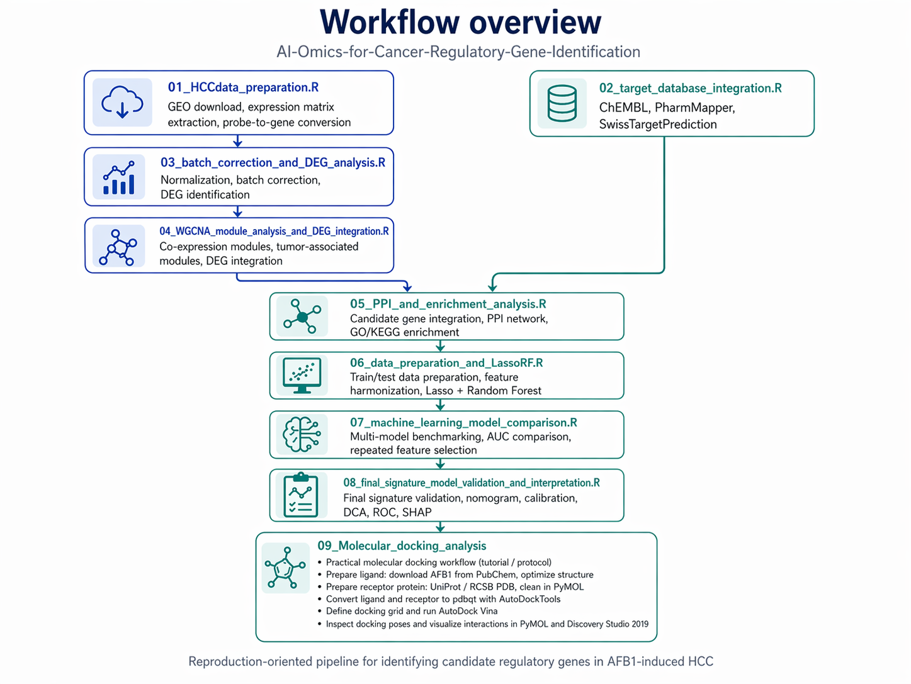

# AI-Omics-for-Cancer-Regulatory-Gene-Identification

A reproduction-oriented workflow for identifying candidate regulatory genes in **aflatoxin B1 (AFB1)-induced hepatocellular carcinoma (HCC)** using transcriptomic analysis, target-database integration, co-expression network analysis, machine learning, and functional interpretation.

---

## Overview

This repository reproduces a published study on **AFB1-induced HCC** by integrating:

- multi-dataset transcriptomic preprocessing
- candidate target collection from public databases
- batch correction and differential expression analysis
- WGCNA module detection
- PPI network and enrichment analysis
- machine-learning-based feature selection and benchmarking
- final signature-model validation and interpretation

   
  <em>Figure. Overall workflow of candidate-gene identification and final signature validation.</em>

> Replace the image path above with your own workflow figure after uploading it to an `images/` folder.

---

## Repository structure

scripts/
├── 01_HCCdata_preparation.R
├── 02_target_database_integration.R
├── 03_batch_correction_and_DEG_analysis.R
├── 04_WGCNA_module_analysis_and_DEG_integration.R
├── 05_PPI_and_enrichment_analysis.R
├── 06_data_preparation_and_LassoRF.R
├── 07_machine_learning_model_comparison.R
└── 08_final_signature_model_validation_and_interpretation.R

## Workflow
### 01_HCCdata_preparation.R

Downloads and preprocesses GEO datasets, extracts expression matrices and phenotype information, converts probe IDs to gene symbols, and generates gene-level expression matrices for downstream analysis.

### 02_target_database_integration.R

Integrates candidate AFB1-related target genes from multiple target-prediction resources, including ChEMBL, PharmMapper, and SwissTargetPrediction.

### 03_batch_correction_and_DEG_analysis.R

Merges transcriptomic datasets, performs normalization and batch correction, and identifies differentially expressed genes between tumor and adjacent non-tumor samples.

### 04_WGCNA_module_analysis_and_DEG_integration.R

Constructs weighted gene co-expression networks, identifies tumor-associated modules, extracts module genes, and integrates WGCNA results with DEG results.

### 05_PPI_and_enrichment_analysis.R

Combines HCC-related and AFB1-related candidate genes, builds a PPI network, and performs GO/KEGG enrichment analysis for functional interpretation.

### 06_data_preparation_and_LassoRF.R

Prepares multi-cohort training and test datasets, harmonizes candidate-gene expression matrices, and applies a Lasso + Random Forest workflow for tumor classification.

### 07_machine_learning_model_comparison.R

Benchmarks multiple machine-learning pipelines, compares AUC across cohorts, and summarizes genes repeatedly retained across different models.

### 08_final_signature_model_validation_and_interpretation.R

Validates the final selected gene signature using logistic regression, nomogram, calibration, DCA, ROC analysis, and SHAP-based model interpretation.

## Recommended execution order

Run the scripts in the following order:

- 01_HCCdata_preparation.R
- 02_target_database_integration.R
- 03_batch_correction_and_DEG_analysis.R
- 04_WGCNA_module_analysis_and_DEG_integration.R
- 05_PPI_and_enrichment_analysis.R
- 06_data_preparation_and_LassoRF.R
- 07_machine_learning_model_comparison.R
- 08_final_signature_model_validation_and_interpretation.R

## Key outputs

Depending on the script, representative outputs include:

- cleaned gene-level expression matrices
- phenotype tables
- DEG result tables
- WGCNA module gene lists
- candidate-gene integration tables
- PPI network inputs and plots
- GO / KEGG enrichment results
- train.csv / test.csv
- model risk matrices and class matrices
- AUC comparison tables and heatmaps
- final diagnostic-model outputs, including nomogram, calibration, DCA, ROC, and SHAP plots

## Notes

Most scripts currently use local absolute paths and should be adapted to your own environment before running.
Some steps are designed for paper reproduction, so certain gene lists or figure-oriented steps may include alignment with published results.
Scripts 06–08 represent three related but distinct machine-learning stages:
06: data preparation and baseline Lasso + RF workflow
07: multi-model comparison and feature-stability analysis
08: final signature validation and interpretation

## Requirements

This project is mainly implemented in R. Commonly used packages include:

- GEOquery
- dplyr
- tidyverse
- data.table
- limma
- sva
- WGCNA
- ggplot2
- pheatmap
- clusterProfiler
- org.Hs.eg.db
- glmnet
- randomForestSRC
- caret
- pROC
- rms
- rmda
- shapviz

## Citation

This repository is a reproduction-oriented workflow based on a published study of AFB1-induced hepatocellular carcinoma. Please cite the original paper if you use this workflow in your research.
